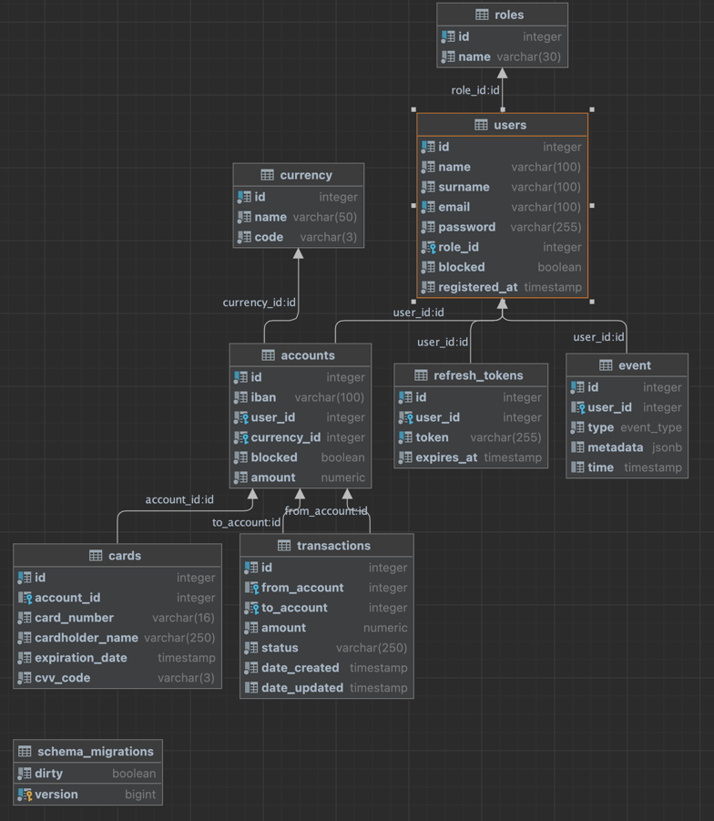

# Banking application

----

### To run the application, you need to have docker installed on your computer. Nothing else is needed, since all parts are automated, containerized and run by one common command.


```shell
make run
```

#### Execute the command make run and application will be started using docker-compose. You have to wait some time while all containers will be started and ready. (approximately 15 seconds)
#### You can see other commands from the Makefile.
#### Webserver will be available at `http://localhost:8080`
#### Documentation and endpoints description you can find by the address [https://documenter.getpostman.com/view/19452086/2s93CGTH3e](https://documenter.getpostman.com/view/19452086/2s93CGTH3e) 

## Application description:
The application has login/registration function and authorization based on a JWT token (see the Postman documentation on how to use it).
1. A user can create as many accounts as they like.
2. The user can get a list of accounts.
3. User can get one account.
4. The user can delete the account.
5. Only the admin has the right to replenish the user's account.
6. The user can transfer money to any accounts that match the currency of the user's account.
7. The payment has one of two statuses: 'prepared' or 'sent'.
8. The user can block his account.
9. Only the admin can unlock the user account.
10. The user can create credit cards tied to a specific account.
11. The user can get a list of their credit cards.
12. The user can receive one specific credit card.
13. Implemented the ability to sort and paginate:
```
transactions:
- by ID; 
- by date (oldest to newest, newest to oldest);
accounts:
- by ID; 
- by iban; 
- by the balance of the account 
```
14.These actions are recorded in the event log:
````
- create an account; 
- account deleting; 
- account blocking; 
- account unlock; 
- creating a credit card; 
- user blocking; 
- user unlock; 
- money transfer; 
- account deposit;
````
15.The system administrator has the rights to:
````
user lock/unlock;
blocking/unblocking one of the user's accounts.
````


### Database schema visualization: 
